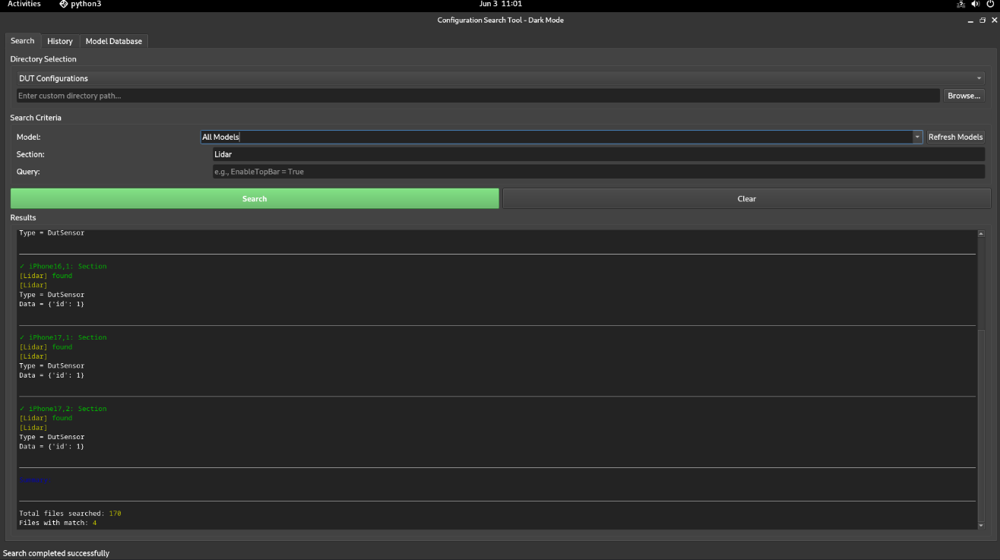

# 🔍 Config Search Tool

<div align="center">



[](https://www.python.org/downloads/)
[](https://pypi.org/project/PyQt5/)
[](https://www.linux.org/)
[](https://www.debian.org/)

**A powerful multi-interface tool for searching and analyzing configuration files**

[Features](#-features) • [Installation](#-installation) • [Usage](#-usage) • [Documentation](#-documentation) • [Contributing](#-contributing)

</div>

---

## 📖 Overview

Config Search Tool is a comprehensive utility designed for engineers and technicians to efficiently search and analyze `.ini` configuration files across multiple directories. It provides both command-line and graphical user interfaces, making it perfect for both automated scripts and interactive use.

### 🎯 Key Benefits

- **🚀 Lightning Fast**: Efficient search algorithms using native Unix tools
- **🎨 Dual Interface**: Choose between CLI for automation or GUI for interactive use
- **🌙 Dark Mode**: Easy on the eyes with a modern dark-themed interface
- **📊 Search History**: Track and revisit previous searches
- **🔐 Offline Operation**: Works completely offline for secure environments
- **🎯 Precision Search**: Multiple search criteria for refined results

## ✨ Features

### 🔍 Search Capabilities
- **Model Search**: Search by device model (e.g., iPhone14,4, Galaxy S22)
- **Section Search**: Find specific configuration sections (e.g., CameraRearPhoto, Proximity)
- **Query Search**: Search for specific parameters (e.g., "EnableTopBar = True")
- **Combined Search**: Use multiple criteria simultaneously for precise results


### 🎨 User Interface Features
- **Three-Tab Design**:
  - 📍 **Search Tab**: Main search interface
  - 📜 **History Tab**: View previous searches with timestamps
  - 📱 **Model Database Tab**: Manage device model mappings
- **Color-Coded Results**: Visual feedback for found/not found items
- **Model Name Resolution**: User-friendly device names instead of codes

## 🛠️ Installation

### Prerequisites
- **Operating System**: Debian 12 (Bookworm) or newer
- **Python**: Version 3.9 or higher
- **Shell**: Bash shell

### Quick Install

```bash
# Clone the repository
git clone https://github.com/yourusername/config-search-tool.git
cd config-search-tool

# Run the installer
sudo bash scripts/install.sh
```

### Manual Installation

1. **Install Dependencies**:
```bash
sudo apt update
sudo apt install -y python3 python3-pip python3-pyqt5
```

2. **Set Up the Tool**:
```bash
# Create installation directory
sudo mkdir -p /opt/config-search-tool

# Copy files
sudo cp configSearchTool.sh config_search_ui.py /opt/config-search-tool/
sudo chmod +x /opt/config-search-tool/*.{sh,py}

# Create symbolic links
sudo ln -sf /opt/config-search-tool/configSearchTool.sh /usr/local/bin/configsearch
sudo ln -sf /opt/config-search-tool/config_search_ui.py /usr/local/bin/configsearch-ui
```

3. **Create Desktop Entry** (Optional):
```bash
cat << EOF | sudo tee /usr/share/applications/config-search-tool.desktop
[Desktop Entry]
Name=Config Search Tool
Comment=Search configuration files
Exec=/usr/local/bin/configsearch-ui
Icon=system-search
Type=Application
Categories=Utility;Development;
Terminal=false
EOF
```

## 🚀 Usage

### Command Line Interface

#### Basic Usage
```bash
# Interactive mode (prompts for input)
configsearch

# Search for a section in all files
configsearch -s CameraRearPhoto

# Search for a specific model
configsearch -m iPhone14,4

# Search for a query string
configsearch -z "EnableTopBar = True"
```

#### Advanced Usage
```bash
# Combine multiple search criteria
configsearch -m iPhone14,4 -s CameraRearPhoto -d 2

# Search in custom directory
configsearch -c /path/to/custom/configs -s Network

# Search with all options
configsearch -m "Galaxy S22" -s Display -z "Brightness = 100" -d 1
```

#### Command Line Options
| Option | Description | Example |
|--------|-------------|---------|
| `-m` | Model name or code | `-m iPhone14,4` |
| `-s` | Section name | `-s CameraRearPhoto` |
| `-z` | Query string | `-z "EnableTopBar = True"` |
| `-d` | Directory selection (1-5) | `-d 2` |
| `-c` | Custom directory path | `-c /custom/path` |
| `-h` | Show help message | `-h` |

### Graphical User Interface

1. **Launch the Application**:
```bash
configsearch-ui
# Or from your application menu
```

2. **Perform a Search**:
   - Select a directory from the dropdown menu
   - Choose a device model or select "All Models"
   - Enter section name and/or query string
   - Click "Search" button

3. **View Results**:
   - Results appear with color coding:
     - 🟢 **Green**: Found items
     - 🔴 **Red**: Not found items
     - 🔵 **Blue**: Headers and information

4. **Manage Search History**:
   - Switch to "History" tab to view previous searches
   - Double-click any entry to re-run that search

5. **Edit Model Database**:
   - Go to "Model Database" tab
   - Add, edit, or remove model mappings
   - Changes are saved automatically

## 📁 Project Structure

```
config-search-tool/
├── 📄 README.md              # This file
├── 🖼️ AppSnapshot.png        # GUI screenshot
├── 🔧 configSearchTool.sh    # Core search script
├── 🎨 config_search_ui.py    # PyQt5 GUI application
└── 📂 scripts/
    ├── 📦 install.sh         # Installation script
    └── 🛠️ setup.sh          # Project setup script
```

## 🔧 Configuration

### Model Database
The tool maintains a JSON database (`model_database.json`) mapping device codes to friendly names:

```json
{
  "iPhone14,4": "iPhone 13 Mini",
  "iPhone14,5": "iPhone 13",
  "SM-S901U": "Galaxy S22",
  ...
}
```

### Adding Custom Directories
1. **Via GUI**: Use the custom directory option in the dropdown
2. **Via CLI**: Use the `-c` flag with your directory path

## 🤝 Contributing

We welcome contributions! Here's how you can help:

1. **Fork the Repository**
2. **Create a Feature Branch**: `git checkout -b feature/AmazingFeature`
3. **Commit Changes**: `git commit -m 'Add some AmazingFeature'`
4. **Push to Branch**: `git push origin feature/AmazingFeature`
5. **Open a Pull Request**

### Development Setup

```bash
# Clone your fork
git clone https://github.com/yourusername/config-search-tool.git
cd config-search-tool

# Set up development environment
python3 -m venv venv
source venv/bin/activate
pip install PyQt5

# Run tests (if available)
python -m pytest tests/
```


## 🙏 Acknowledgments

- Built with [PyQt5](https://www.riverbankcomputing.com/software/pyqt/) for the GUI
- Uses native Unix tools for efficient searching
- Inspired by the need for better configuration management tools


---

<div align="center">
Made with ❤️ by Yours Truly (:

⭐ Stars help :D
</div>
